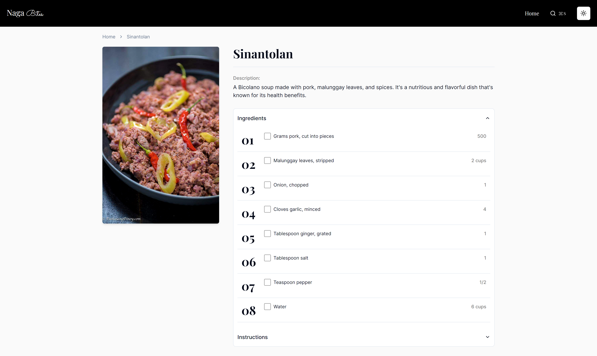

# **Bicolbites** https://bicolbites.vercel.app/

> <sup>Short Description</sup>

Bicolbites is a simple recipe catalogue web application ephasizing special dishes from the Bicol Region, Philippines.

## Home page


## Specific recipe page



## **Conventions**

1. **Github**
    - Commits:
        ```shell
        git commit -m [action]: [description]
        ```
        - Action:
          | Option | Information |
          | :---: | :--- |
          | `feat` | New feature for the user, not a new feature for build script. |
          | `fix` | Bug fix for the user, not a fix to a build script. |
          | `docs` | Changes to the documentation. |
          | `style` | Formatting, missing semi colons, etc; no production code change |
          | `refactor` | Refactoring production code, eg. renaming a variable |
          | `test` | Adding missing tests, refactoring tests; no production code change |
          | `chore` | Updating grunt tasks etc; no production code change. |
    - Branching:
        ```shell
            git branch '[layer]/[description]' '[commit-hash]'
            --- or ---
            git checkout -b '[layer]/[description]' '[commit-hash]'
        ```
        - Layer:
            - `frontend` - A branch that concerns the frontend (**presentation layer**) of the project.
            - `backend` - A branch that concerns the backend (**data access layer**) of the project.
        - Description:
            - Options: `feature`, `description`, or `bugfix`.
        - Commit Hash (Optional):
            - Create a branch of `[layer]/[description]` from a previous commit using the `[commit-hash]`.
